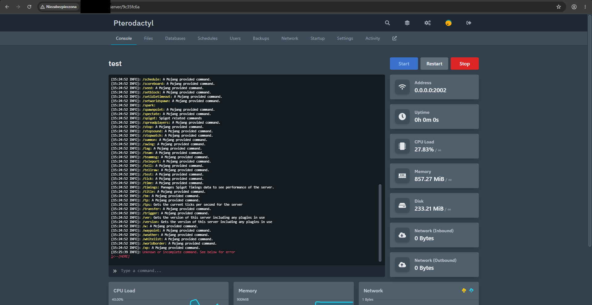

<div align="center">

# pywings

**Lightweight, Rootless Python Implementation of Pterodactyl Wings**

[](LICENSE)
[](https://www.python.org/)
[](https://pterodactyl.io/)
[](#architecture--security)
[](#automatic-self-updater)

<br/>



<br/>
<br/>

`pywings` is a drop-in, rootless replacement for the official Pterodactyl Wings daemon. It executes game servers and egg workloads without requiring `root` privileges, Linux user namespaces (`CLONE_NEWUSER`), or the Docker daemon (`dockerd`).

</div>

---

## ⚡ Why pywings?

Traditional Pterodactyl Wings requires:
- Full `root` access on the host node
- The Docker daemon running via `/var/run/docker.sock`
- Host kernel cgroups (v1 or v2) with administrative control
- Unrestricted user namespace creation

In environments such as **unprivileged LXC containers**, **nested Docker/Pterodactyl nodes**, **shared hosting**, **restricted VPS instances**, or **Android Termux**, running Docker is often impossible or prohibited.

**`pywings` solves this by decoupling Wings from Docker:**
1. **Direct OCI Registry Client**: Pulls image manifests and layer blobs directly from Docker Hub, GHCR, Quay, and private registries via HTTPS.
2. **Safe Rootfs Synthesizer**: Reconstructs complete OCI container root filesystems locally, applying whiteout layers and file permissions.
3. **Userspace PRoot Sandbox**: Executes container processes in userspace with fake root (`-0`), rootfs containment (`-r`), and sandboxed bind mounts, avoiding host privilege requirements.

---

## 📊 Comparison: Go Wings vs. pywings

| Feature | Official Wings (`wings-develop`) | pywings |
| :--- | :---: | :---: |
| **Language** | Go | Python 3.10+ |
| **Root Privileges Required** | **Yes (`root` / `sudo`)** | **No (100% Rootless Userspace)** |
| **Docker Daemon Required** | **Yes (`dockerd` / `containerd`)** | **No (Native OCI + PRoot)** |
| **Runs inside unprivileged containers** | ❌ Fails without nesting/tun | ✅ Native support |
| **Full Pterodactyl API Compatibility** | ✅ 100% | ✅ 100% (All 39 endpoints) |
| **WebSocket Console & Stats Telemetry** | ✅ Yes | ✅ Yes (Real-time rx/tx, CPU, RAM, ms) |
| **Integrated SFTP Server** | ✅ Yes (Port 2022) | ✅ Yes (Port 2022, per-user ACLs) |
| **Server Backups & Restores** | ✅ Yes | ✅ Yes (tar.gz, SHA256 checksums) |
| **Daemon-to-Daemon Server Transfers** | ✅ Yes | ✅ Yes (Preserves existing backups) |
| **Crash Detection & Auto-Restart** | ✅ Yes | ✅ Yes (Loop protection < 60s) |
| **Egg Configuration Parser** | ✅ JSON, YAML, INI, XML | ✅ JSON, YAML, INI, Properties, XML |
| **Automatic Self-Updater** | ❌ Manual binary swap | ✅ Built-in GitHub sync |

---

## ✨ Features

- **100% Pterodactyl Panel Compatibility**: Implements all HTTP control plane endpoints (`/api/servers/*`, `/api/system`, `/api/transfers`, `/api/update`, signed URLs).
- **Direct Registry Pulling**: Native OCI client with multi-architecture platform resolution (`linux/amd64`, `linux/arm64`), automatic layer decompression, and content-addressable caching.
- **Universal Egg Support**: Works seamlessly with Python, Node.js, Java (Temurin/OpenJDK), Rust, Go, Alpine, Debian, and Ubuntu-based eggs.
- **Zero-Lock Instant Kill**: Instantaneous process termination using recursive `/proc` tree scanning (`pgrp`, `cwd`, and environment tagging) to terminate stubborn runaway processes without socket hangs.
- **Live Bidirectional WebSocket**: Real-time console streaming, command execution, power lifecycle handling, installation progress streaming, and millisecond-accurate uptime telemetry.
- **Integrated SFTP Subsystem**: Built-in SSH/SFTP server validating credentials directly against the Panel API and logging user file operations to the Panel activity log.
- **Automatic GitHub Self-Updater**: Background daemon worker that continuously monitors GitHub for upstream updates and performs in-place zero-downtime restarts.

---

## 🛠️ Requirements

- **Python**: 3.10 or higher
- **PRoot Binary**: Available in your `PATH`, located at `/home/container/.tools/proot`, or pointed to via the `PROOT_PATH` environment variable.
- **Operating System**: Linux (x86_64 or aarch64)

---

## 🚀 Installation & Quick Start

### 1. Clone the repository

```bash
git clone https://github.com/SkidTechnologies/pywings.git
cd pywings
```

### 2. Install dependencies

```bash
pip install -r requirements.txt
```

### 3. Configure pywings

You can automatically configure `pywings` using the configuration command generated by your Pterodactyl Panel (Admin -> Nodes -> [Your Node] -> Configuration):

```bash
python app.py --configure --panel-url https://panel.example.com --token <YOUR_TOKEN> --node <NODE_UUID>
```

Alternatively, create `config.yml` manually or paste the YAML configuration from the Panel:

```bash
cp config.example.yml config.yml
nano config.yml
```

### 4. Run pywings

**Development / Standalone Mode:**
```bash
python app.py
```

**Production Mode (Gunicorn):**
```bash
gunicorn -w 1 -k gthread --threads 10 -b 0.0.0.0:8080 wsgi:app
```

---

## ⚙️ Configuration Reference (`config.yml`)

```yaml
debug: false
uuid: "your-node-uuid"
token_id: "your-token-id"
token: "your-node-token"
api:
  host: "0.0.0.0"
  port: 8080
  ssl:
    enabled: false
    cert: ""
    key: ""
  upload_limit: 100
system:
  data: "./data"
  sftp:
    bind_address: "0.0.0.0"
    bind_port: 2022
remote: "https://panel.example.com"
allowed_mounts: []
```

---

## 📦 Systemd Service (Production)

Create a systemd unit file at `/etc/systemd/system/pywings.service`:

```ini
[Unit]
Description=pywings Daemon
After=network.target

[Service]
User=container
WorkingDirectory=/home/container/pywings
ExecStart=/usr/bin/python3 /home/container/pywings/app.py
Restart=always
RestartSec=5
LimitNOFILE=65535

[Install]
WantedBy=multi-user.target
```

Enable and start the service:

```bash
sudo systemctl daemon-reload
sudo systemctl enable --now pywings
```

---

## 🩺 Diagnostics & Troubleshooting

To generate a system diagnostic report compatible with Pterodactyl support:

```bash
python app.py --diagnostics
```

Useful environment variables:
- `PROOT_PATH`: Path to a custom `proot` executable.
- `PROOT_NO_SECCOMP=1`: Disables seccomp acceleration to prevent ptrace collisions in nested containers (enabled by default).
- `GLIBC_TUNABLES=glibc.pthread.rseq=0`: Prevents glibc 2.35+ `rseq` SIGSEGV issues under PRoot (enabled by default).
- `WINGS_AUTO_UPDATE=true`: Toggles background automatic updating (default: `true`).
- `WINGS_UPDATE_INTERVAL=60`: Check frequency in seconds for new versions.

---

## 📄 License

This project is licensed under the **Creative Commons Zero v1.0 Universal (CC0 1.0)** public domain dedication.

See the [LICENSE](LICENSE) file for full details.

```text
The person who associated a work with this deed has dedicated the work to the
public domain by waiving all of his or her rights to the work worldwide under
copyright law, including all related and neighboring rights, to the extent
allowed by law.
```

---

<div align="center">
  <b>Built with ❤️ by SkidTechnologies</b>
</div>
